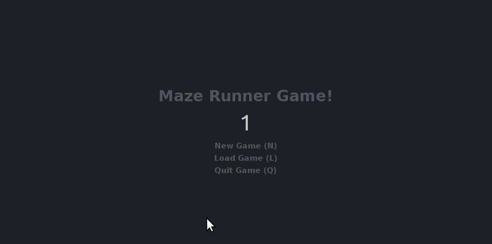

# Maze-Game
This is a class project at UC Berkeley CS61 series.

In this project, we create a simple maze game where the player is able to move around the maze to find a key and unlock the exit door. This maze is decorated with a few interesting things like flower, water, and instance door that can instantly move to a random place.

## Control
1. Use "W S A D" to move up, down, left, and right.
2. To save and exit the game, press ':q'
3. To exit without saving, press 'q'
